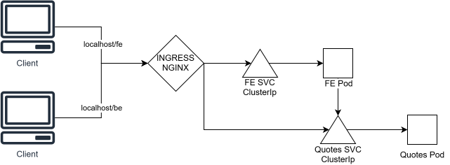
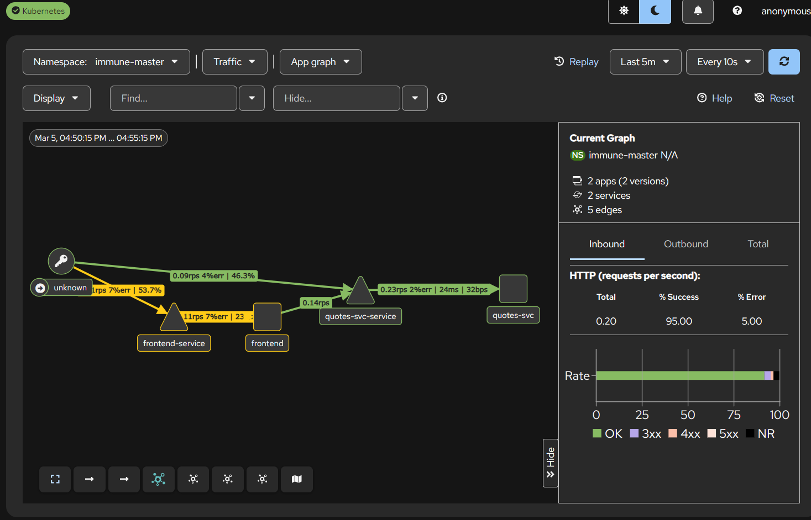
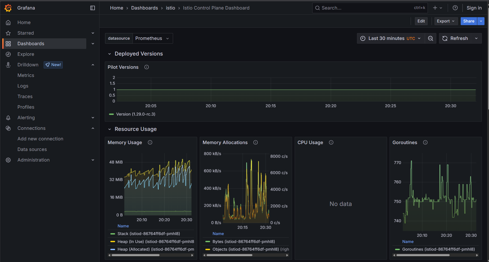

# immune-master-contenerizacion

## Services

### Frontend Service
- **Location**: `./services/frontend-service/`
- **Technology**: Node.js
- **Dockerfile**: Included
- **Documentation**: `./services/frontend-service/README.md`

### Quotes Service
- **Location**: `./services/quotes-service/`
- **Technology**: Python
- **Dockerfile**: Included
- **Documentation**: `./services/quotes-service/README.md`

## Docker Compose
- **File**: `./services/docker-compose.yml`
- **Purpose**: Run both services simultaneously for testing before deploying to Kubernetes.

## Kubernetes (K8s)

### Request flow diagram
 

### Request Flow
- A client makes a request to the frontend service, which loads a GUI. The frontend then sends a request to the quotes service, which responds with a random quote.
- Clients can also make direct requests to the quotes service, simulating an exposed API.

### Setup Steps
- **Namespace**: The file `k8s-local/00-namespace.yml` creates a namespace called "immune-master".
- **Verify Namespaces**: Run `kubectl get namespaces`.
- **Verify Current Namespace**: Run `kubectl config view --minify --output 'jsonpath={..namespace}'`.
- **Apps**: Inside `./k8s-local/apps/`, there are directories for `frontend/` and `quotes-svc/`. Each contains a Kubernetes deployment and service definition (ClusterIP).
- **Ingress**: The file `k8s-local/ingress-nginx.yml` creates an ingress allowing external access to the frontend service via `/fe` and `/be` routes.

### Traffic
- **North-South**: Available for both services through the ingress via direct client requests.
- **East-West**:
  - **First Approach**: Frontend to quotes service using Kubernetes CoreDNS at `http://quotes-svc-service.immune-master.svc.cluster.local:8000` (set as an environment variable for the frontend).
  - **Second Approach**: Frontend to quotes service using a service mesh like Istio, which uses the same URL but routes through service mesh mTLS.

## Istio
Istio provides service mesh communication and mTLS between the frontend and quotes services. It is implemented in its own namespace and enables metrics, logging, and tracing.

- **Kiali**: For tracing.
- **Grafana**: For logs and metrics through Prometheus and Loki.
- **Addons/Deployments**: Located at `./k8s-local/istio/addons/`, copied from the official Istio repository.

### Images
- **Kiali Tracing**: 
- **Grafana Metrics**: 